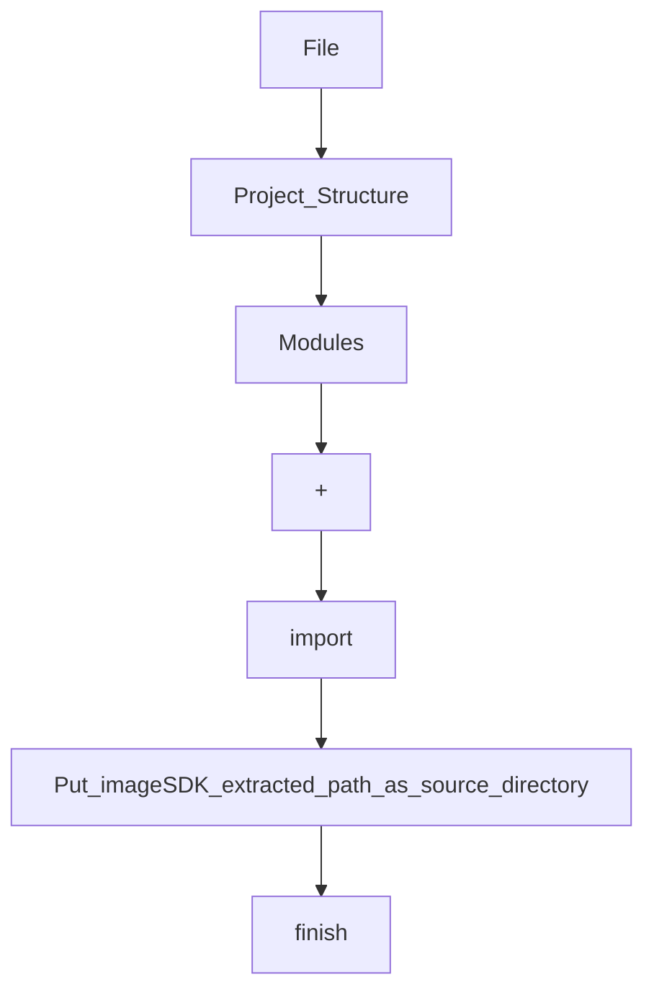
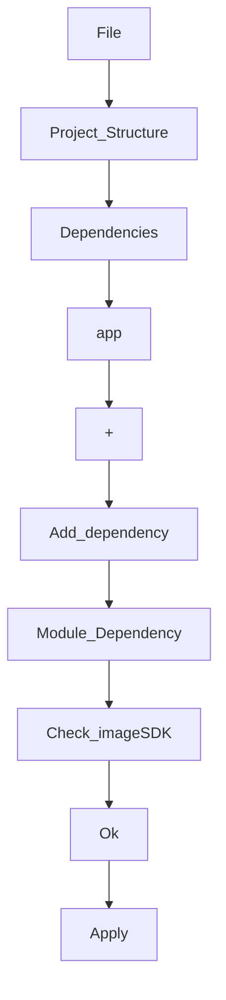

# ImageSDK

ImageSDK is a android library which helps host applications to extract text and detect human face from an identity card by taking picture using rear camera.


## Download
You can download it from [github](https://github.com/rubayetevan/ImageReader).
Then extract it to your local disk. Now open your project in android studio and go to:


Again go to:


Check your `build.gradle` file
```groovy

dependencies {
    implementation 'androidx.core:core-ktx:1.7.0'
    implementation 'androidx.appcompat:appcompat:1.4.2'
    implementation 'com.google.android.material:material:1.6.1'
    implementation 'androidx.constraintlayout:constraintlayout:2.1.4'
    implementation project(path: ':imageSDK') // check this line
    testImplementation 'junit:junit:4.13.2'
    androidTestImplementation 'androidx.test.ext:junit:1.1.3'
    androidTestImplementation 'androidx.test.espresso:espresso-core:3.4.0'
}

```

Check your `settings.gradle` file
```groovy

pluginManagement {
    repositories {
        gradlePluginPortal()
        google()
        mavenCentral()
    }
}
dependencyResolutionManagement {
    repositoriesMode.set(RepositoriesMode.FAIL_ON_PROJECT_REPOS)
    repositories {
        google()
        mavenCentral()
    }
}
rootProject.name = "My Application"
include ':app'
include ':imageSDK' // check this line


```


