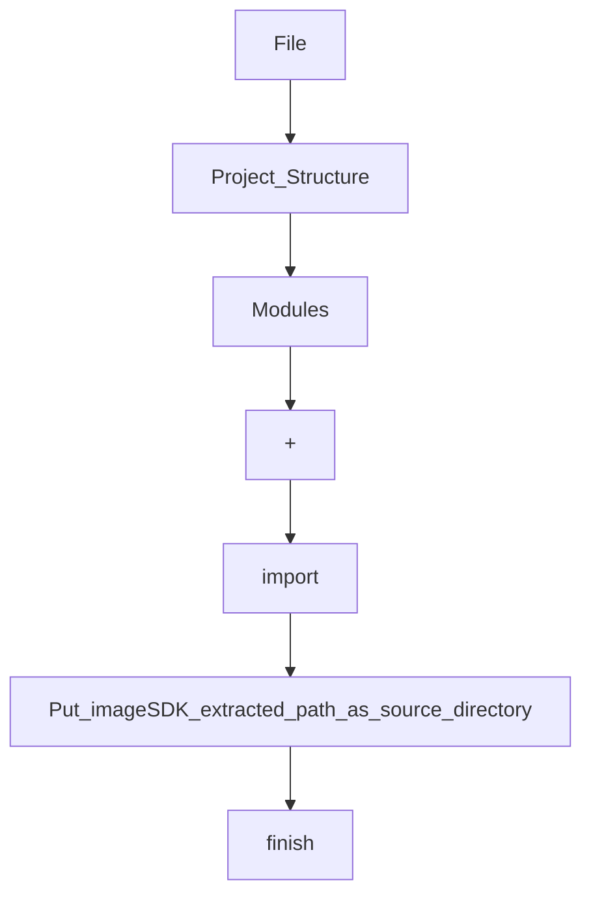
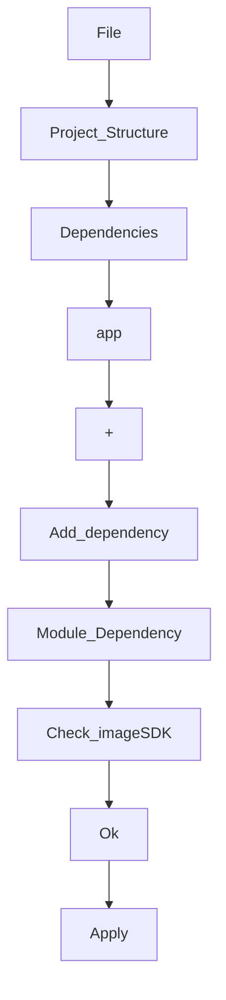

# ImageSDK 
[Report an issue](https://github.com/rubayetevan/ImageReader/issues)

ImageSDK is a android library which helps host applications to extract text and detect human face from an identity card by taking picture using rear camera. ImageSDK uses google's ML kit to process the image.


## Download and Setup
You can download it from [github](https://github.com/rubayetevan/ImageReader) as zip file.
Then extract it to your local disk. Now open your project in android studio and go to:

imageSDK_extracted_path: `../ImageReader/imageSDK`

Again go to:


Check your `build.gradle` file
```groovy

dependencies {
    implementation 'androidx.core:core-ktx:1.7.0'
    implementation 'androidx.appcompat:appcompat:1.4.2'
    implementation 'com.google.android.material:material:1.6.1'
    implementation 'androidx.constraintlayout:constraintlayout:2.1.4'
    implementation project(path: ':imageSDK') // <--check this line
    testImplementation 'junit:junit:4.13.2'
    androidTestImplementation 'androidx.test.ext:junit:1.1.3'
    androidTestImplementation 'androidx.test.espresso:espresso-core:3.4.0'
}

```

Check your `settings.gradle` file
```groovy

pluginManagement {
    repositories {
        gradlePluginPortal()
        google()
        mavenCentral()
    }
}
dependencyResolutionManagement {
    repositoriesMode.set(RepositoriesMode.FAIL_ON_PROJECT_REPOS)
    repositories {
        google()
        mavenCentral()
    }
}
rootProject.name = "My Application"
include ':app'
include ':imageSDK' // <--check this line


```

Add these lines on your app's `build.gradle` file
```groovy

android {
    
    compileOptions {
        sourceCompatibility JavaVersion.VERSION_1_8
        targetCompatibility JavaVersion.VERSION_1_8
    }
   
}

```

## How do I use ImageSDK?

Simple use cases will look something like this:

```kotlin

class MainActivity : AppCompatActivity() {
    
    private lateinit var viewBinding: ActivityMainBinding

    override fun onCreate(savedInstanceState: Bundle?) {
        super.onCreate(savedInstanceState)
        viewBinding = ActivityMainBinding.inflate(layoutInflater)
        setContentView(viewBinding.root)

        viewBinding.btnDetectFace.visibility= View.VISIBLE
        viewBinding.btnReadText.visibility= View.VISIBLE

        viewBinding.btnDetectFace.setOnClickListener {
            viewBinding.imageFace.setImageResource(0)
            ImageReaderActivity.start(this@MainActivity,
                getContent,
                RecognizeType.FACE)
        }
        
        viewBinding.btnReadText.setOnClickListener {
            viewBinding.txtResult.text = ""
            ImageReaderActivity.start(this@MainActivity,
                getContent,
                RecognizeType.TEXT)
        }

    }

    private val getContent =
        registerForActivityResult(ActivityResultContracts.StartActivityForResult()) { it ->
          
            it.data?.getStringExtra(ImageReaderActivity.KEY_RECOGNIZE_TYPE)?.let { rtype ->
                
                val data = it.data?.getStringExtra(ImageReaderActivity.KEY_DATA)
                
                when (RecognizeType.valueOf(rtype)) {
                
                    RecognizeType.FACE -> {
                        if (it.resultCode == ImageReaderActivity.RESULT_SUCCESS) {
                        
                            val uri = Uri.parse(data)
                            Picasso.get().load(uri).into(viewBinding.imageFace)
                            viewBinding.btnDetectFace.visibility= View.GONE
                            
                        } else if (it.resultCode == ImageReaderActivity.RESULT_ERROR) {
                        
                            viewBinding.btnDetectFace.visibility= View.VISIBLE
                            val numberOfFaces = it.data?.getIntExtra(ImageReaderActivity.KEY_NUMBER_OF_FACES, 0)
                            Toast.makeText(this@MainActivity,
                                "$numberOfFaces face(s) detected in the image",
                                Toast.LENGTH_SHORT).show()
                                
                        }
                    }
                    
                    RecognizeType.TEXT -> {
                        if (it.resultCode == ImageReaderActivity.RESULT_SUCCESS) {
                        
                            viewBinding.txtResult.text = data
                            viewBinding.btnReadText.visibility= View.GONE
                            
                        } else if (it.resultCode == ImageReaderActivity.RESULT_ERROR) {
                        
                            viewBinding.btnReadText.visibility= View.VISIBLE
                            Toast.makeText(this@MainActivity,
                                "Unable to detect $rtype in the image",
                                Toast.LENGTH_SHORT).show()
                                
                        }
                    }
                }
            }
        }

}

```
## Compatibility

```groovy
android {
    compileSdk 32
    buildToolsVersion '32.1.0-rc1'

    defaultConfig {
        minSdk 21
        targetSdk 32
    }
 }
```
## Status
Version 1 is now released and stable.

## Sample
Sample app path: `../ImageReader`

## License
[Apache License, Version 2.0](https://www.apache.org/licenses/LICENSE-2.0)

## Thanks
Google ML Kit
